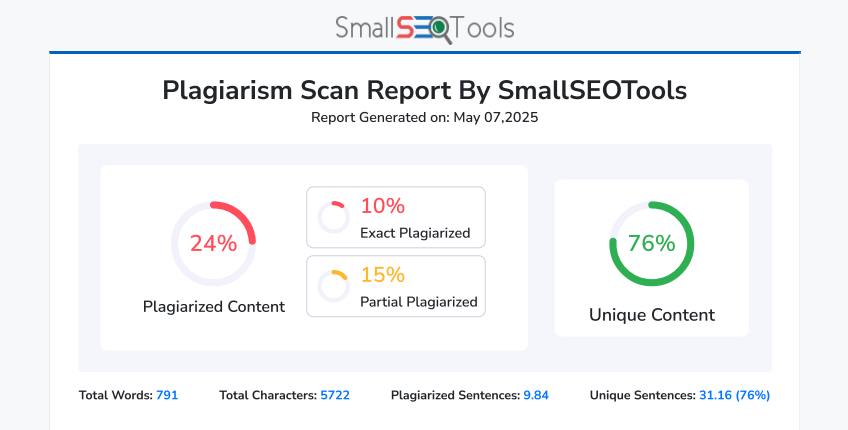
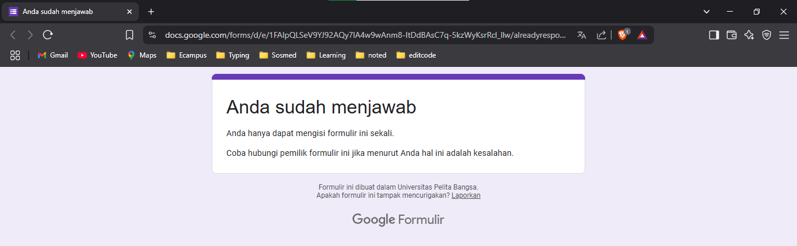
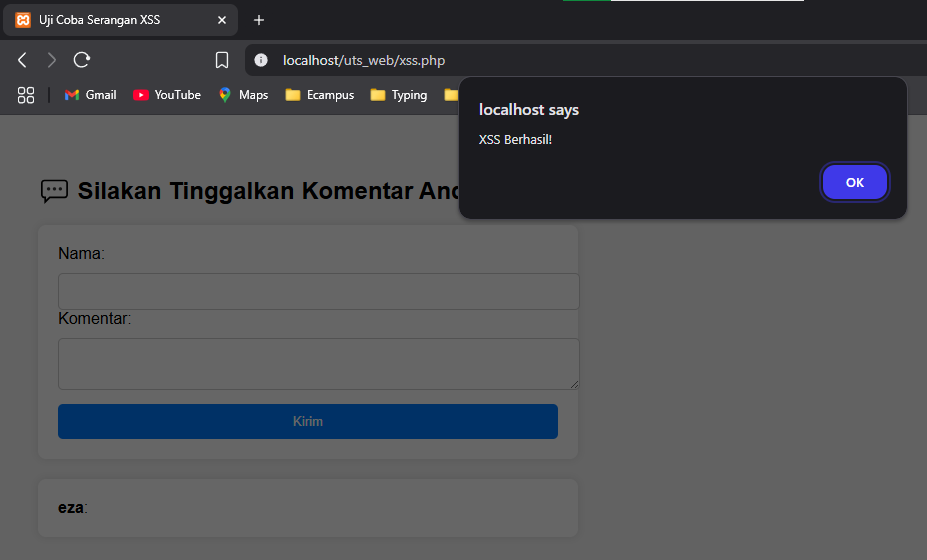
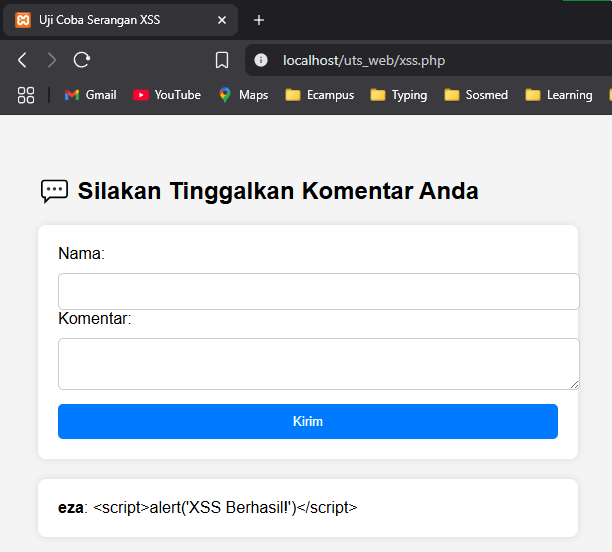

# Cross-Site Scripting (XSS)
Tugas UTS Pemrograman Web2 - Semester 4

### 🔗 [Link Medium] https://medium.com/@zayusuf2002/membongkar-cross-site-scripting-xss-eksperimen-langsung-menemukan-celah-keamanan-di-aplikasi-web-14faec02a449

### Hasil Plagiasi:
🔗 [Link Plagiasi 1](https://smallseotools.com/id/plagiarism-checker/)

---

## 📝 Submit Form

---

## 📸 Tampilan
### Uji coba 1️⃣:
> Pada web yang tingkat keamanan rentan:

> Pada web yang tingkat keamanan cukup baik:

